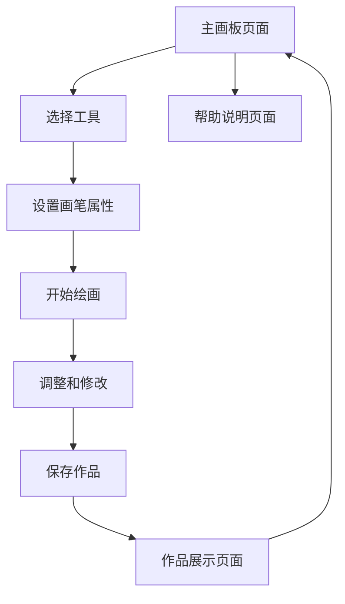

# 画板应用产品需求文档

## 1. 产品概述
一个基于Web的在线画板应用，用户可以在浏览器中进行自由绘画创作。
- 提供直观易用的绘画工具，让用户能够快速上手进行数字绘画创作，支持画笔硬度调节和多种绘画模式。
- 面向所有年龄段的用户，特别是喜欢二次元风格的绘画爱好者、学生和设计师。
- 通过简单的Web界面提供专业级的绘画体验，使用原生HTML+CSS+JavaScript开发，无需安装任何软件。

## 2. 核心功能

### 2.1 用户角色
由于是简单的画板应用，不需要复杂的用户角色区分，所有用户都具有相同的功能权限。

### 2.2 功能模块
我们的画板应用包含以下主要页面：
1. **主画板页面**：画布区域、工具栏、颜色选择器、画笔设置面板
2. **作品展示页面**：作品缩略图展示、作品详情查看
3. **帮助说明页面**：使用教程、快捷键说明

### 2.3 页面详情

| 页面名称 | 模块名称 | 功能描述 |
|----------|----------|----------|
| 主画板页面 | 画布区域 | 提供绘画区域，支持鼠标和触摸绘画，实时显示绘画内容 |
| 主画板页面 | 工具栏 | 包含画笔、橡皮擦、油漆桶、基本形状工具（矩形、椭圆、三角形等）等绘画工具 |
| 主画板页面 | 颜色选择器 | 提供颜色面板选择，支持RGB调色和预设颜色 |
| 主画板页面 | 画笔设置 | 调整画笔粗细、透明度、硬度（0-100，控制边缘清晰度和羽化程度）等属性 |
| 主画板页面 | 形状设置 | 设置基本形状的线条颜色、填充颜色、线条粗细等属性 |
| 主画板页面 | 油漆桶工具 | 在封闭区域内填充指定颜色，支持容差设置 |
| 主画板页面 | 操作面板 | 撤销、重做、清空画布、保存作品到本地、导出图片功能 |
| 作品展示页面 | 作品列表 | 显示已保存的作品缩略图，支持预览和删除 |
| 作品展示页面 | 作品详情 | 查看作品完整信息，支持重新编辑和分享 |
| 帮助说明页面 | 使用教程 | 提供基本操作指南和绘画技巧说明 |
| 帮助说明页面 | 快捷键说明 | 列出所有可用的键盘快捷键 |

## 3. 核心流程

**主要用户操作流程：**
1. 用户进入主画板页面
2. 选择绘画工具（画笔、橡皮擦、油漆桶、基本形状等）
3. 设置工具属性（颜色、粗细、透明度、硬度0-100等）
4. 在画布上进行绘画创作或使用油漆桶填充封闭区域
5. 使用基本形状工具绘制矩形、椭圆、三角形等，设置线条和填充
6. 使用撤销/重做功能调整作品
7. 保存作品到本地存储
8. 导出作品为图片文件
9. 查看已保存的作品列表

## 4. 用户界面设计

### 4.1 设计风格
- **主色调**：二次元粉色系，浅粉色背景 (#FFF0F5)，深粉色工具栏 (#FF69B4)
- **辅助色**：樱花粉按钮 (#FFB6C1)，薄荷绿保存按钮 (#98FB98)，淡紫色强调 (#DDA0DD)
- **按钮样式**：圆角矩形按钮，3D立体效果，悬停时有粉色光晕阴影
- **字体**：可爱圆润字体，标题18px，正文15px，小字13px，支持emoji表情
- **布局风格**：左侧工具栏 + 中央画布 + 右侧属性面板的经典布局，整体采用卡片式设计
- **图标风格**：可爱的二次元风格图标，支持SVG格式，带有粉色渐变效果

### 4.2 页面设计概览

| 页面名称 | 模块名称 | UI元素 |
|----------|----------|--------|
| 主画板页面 | 工具栏 | 垂直排列的可爱工具图标，选中状态粉色高亮，工具提示悬浮显示 |
| 主画板页面 | 画布区域 | 浅粉色背景，支持缩放和平移，显示淡粉色网格线辅助绘画 |
| 主画板页面 | 颜色选择器 | 粉色系色轮选择器 + RGB滑块 + 二次元风格预设颜色面板，实时预览选中颜色 |
| 主画板页面 | 画笔设置 | 粉色滑块控制粗细、透明度和硬度(0-100)，数值输入框精确设置，硬度显示羽化效果预览 |
| 主画板页面 | 形状设置 | 形状选择按钮（矩形、椭圆、三角形等），线条和填充颜色选择器，粗细调节滑块 |
| 主画板页面 | 油漆桶设置 | 容差调节滑块，填充颜色选择器，封闭区域检测提示 |
| 主画板页面 | 操作面板 | 顶部横向排列粉色按钮，可爱图标+文字标签，快捷键提示，本地保存突出显示 |
| 作品展示页面 | 作品列表 | 粉色卡片式网格布局缩略图，悬停显示操作按钮，支持拖拽排序 |
| 帮助说明页面 | 教程内容 | 分步骤图文说明，可折叠的粉色章节结构，配有可爱插图 |

### 4.3 响应式设计
- 桌面优先设计，支持平板和手机端适配
- 移动端优化触摸操作，增大按钮点击区域
- 支持触摸手势：双指缩放、单指平移画布